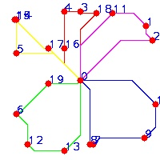

# multi_agent_algorithms
containing all kinds of algorithms about multi-agents or multi-vehicles in various levels, including communication level, prediction level, task level, plan level and control level.

## Communication_level
including broadcast communication, group communication, point2point communication.
 

## task_planning_level
(1) ant colony algorithm for multi-agent task plan:  

the planning path for each agent need to go, and different color indicates different agent: 

